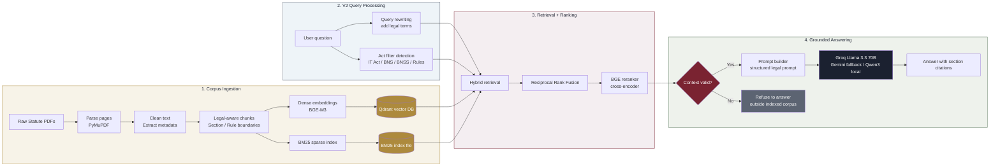

<div align="center">


<br/>

[](https://www.python.org/)
[](https://fastapi.tiangolo.com/)
[](https://qdrant.tech/)
[](https://groq.com/)
[](https://huggingface.co/BAAI/bge-m3)
[]()

**A retrieval-augmented legal assistant that only answers from statute text it can cite — section, page, and source PDF, every time.**

</div>

---

## Why this exists

Most "chat with your law" demos let an LLM answer from its own training data — which means it can confidently cite a section that doesn't exist, or quote a law that was repealed years ago. This system does the opposite: **every answer is grounded in a specific, retrievable chunk of an actual statute PDF**, reranked for relevance, and validated before generation. If the corpus doesn't contain the answer, the system says so instead of guessing.

It also gets a detail most similar projects miss: **India's criminal law was completely rewritten on 1 July 2024.** The IPC, CrPC, and Evidence Act were repealed and replaced by the Bharatiya Nyaya Sanhita (BNS), Bharatiya Nagarik Suraksha Sanhita (BNSS), and Bharatiya Sakshya Adhiniyam (BSA). This system indexes the **current** law, not the colonial-era statutes still floating around in most tutorials.

---

## Architecture



---

## What's indexed

| Act | Replaces | Status |
|---|---|---|
| **Information Technology Act, 2000** (+ 2008 Amendment) | — | Current |
| **IT Rules, 2021** (Intermediary Guidelines & Digital Media Ethics Code) | IT Rules 2011 | Current, amended through 2023 |
| **Bharatiya Nyaya Sanhita, 2023** | Indian Penal Code, 1860 | Current since 1 Jul 2024 |
| **Bharatiya Nagarik Suraksha Sanhita, 2023** | Code of Criminal Procedure, 1973 | Current since 1 Jul 2024 |
| **Consumer Protection Act, 2019** | Consumer Protection Act, 1986 | Current |

Indexed as **3,621 semantically-chunked passages** across 6 source documents.

Scope is deliberately narrow: **cyber law and the statutes it's actually prosecuted alongside**, not "all of Indian law." A focused, high-precision corpus beats a broad, diluted one — see [Design Notes](#design-notes) below.

---

## Pipeline stages

| # | Stage | What happens |
|---|---|---|
| 1 | **Parse** | PyMuPDF extracts raw text per page from each statute PDF |
| 2 | **Clean** | Strips headers/footers/OCR noise, annotates metadata |
| 3 | **Chunk** | Splits on Section/Article/Clause boundaries — not arbitrary character counts |
| 4 | **Embed** | BGE-M3 (1024-dim, multilingual) encodes each chunk |
| 5 | **Store** | Chunks + vectors upload to Qdrant; BM25 sparse index built in parallel |
| V2 | **Rewrite + Filter** | Expands user queries with legal terms and detects Act-level metadata filters |
| 6 | **Retrieve** | Query hits both dense (Qdrant) and sparse (BM25) search, filtered and fused via RRF |
| 7 | **Rerank** | BGE cross-encoder re-scores candidates for true query relevance *(configurable — see below)* |
| 8 | **Validate** | Checks whether retrieved chunks actually answer the question — refuses if not |
| 9 | **Generate** | LLM answers *only* from the validated chunks, with citations |

---

## Tech stack

| Layer | Choice |
|---|---|
| Parsing | PyMuPDF (fitz) |
| Chunking | Custom legal-boundary-aware splitter |
| Dense embeddings | `BAAI/bge-m3` |
| Sparse retrieval | BM25 (`rank_bm25`) |
| Vector DB | Qdrant (hybrid dense + sparse) |
| Reranker | `BAAI/bge-reranker-v2-m3` (cross-encoder, toggleable) |
| Generation | Groq (Llama 3.3 70B) with automatic Gemini fallback for the deployed environment · Qwen3 via Ollama for local, offline development |
| Backend | FastAPI (CORS-enabled) |
| Frontend | Static HTML/CSS/JS — no build step, with a live pipeline-stage visualizer |

### Provider-agnostic generation layer

The generation stage is swappable via a single `LLM_PROVIDER` environment variable — Ollama/Qwen3 for local development, or a cloud path where **Groq is primary and Gemini serves as an automatic fallback** if Groq errors or rate-limits. Every path shares the exact same prompt and grounding rules, so switching providers never changes what the model is allowed to answer from — it's purely an infrastructure decision.

Reranking is similarly configurable via `RERANK_ENABLED`, trading a small amount of precision for lower latency and memory footprint in resource-constrained deployments — a standard cost/quality knob for tuning where the system is running.

---

## V2 retrieval upgrades

- **Query rewriting:** expands common user phrases like "hacking", "FIR", "bail", or "consumer complaint" into statute-friendly retrieval terms.
- **Metadata filtering:** detects Act mentions and filters both Qdrant and BM25 retrieval by stable `source_file` metadata.
- **Prompt builder:** keeps grounded answer instructions and citation formatting in one reusable module.
- **Retrieval evaluation:** runs a small benchmark set and writes a Markdown report with source-hit and term-hit checks.

Run the retrieval evaluation after Qdrant and the BM25 index are ready:

```bash
python -m scripts.evaluate_retrieval --skip-rerank
```

Run without `--skip-rerank` for the slower reranker-included evaluation. The report is written to `snapshots/retrieval_eval_report.md`.

---

## Quick start (local, no Docker)

You'll need four things running: **Qdrant**, an **LLM provider** (Ollama locally, or Groq/Gemini for cloud), the **FastAPI backend**, and the **frontend**.

### 1 — Add the source PDFs
```bash
python -m scripts.download_acts
```
Fetches the five Acts above into `data/raw_pdfs/`. Skips any already present.

### 2 — Start Qdrant
```bash
docker run -p 6333:6333 qdrant/qdrant
```

### 3 — Set up the LLM provider
For local development:
```bash
ollama serve
ollama pull qwen3
```
For cloud generation, set `LLM_PROVIDER=groq` plus `GROQ_API_KEY` and `GEMINI_API_KEY` in `.env` instead — no local model needed.

### 4 — Ingest the corpus (one-time, or after adding new PDFs)
```bash
pip install -r requirements.txt
python -m src.pipeline --ingest
```

### 5 — Start the API
```bash
uvicorn api.main:app --host 0.0.0.0 --port 8000
```

### 6 — Open the frontend
Open `app/index.html` directly in a browser. It talks to `http://localhost:8000` — no server needed for the UI itself.

---

## API

```
POST /query
{
  "question": "What is the punishment for hacking under the IT Act?"
}
```

```json
{
  "answer": "Under Section 66 of the IT Act, 2000...",
  "citations": [
    {
      "act_name": "IT_Act_2000",
      "section_no": "66",
      "source_file": "IT_Act_2000.pdf",
      "page_num": 25,
      "rerank_score": 0.992
    }
  ],
  "valid": true,
  "query_metadata": {
    "original_question": "What is the punishment for hacking under the IT Act?",
    "rewritten_question": "What is the punishment for hacking under the IT Act? Related legal terms: unauthorised access, computer resource, Section 66.",
    "act_filter": ["it_act"],
    "act_filter_display": ["Information Technology Act, 2000"]
  }
}
```

`GET /health` — liveness check.

---

## Design notes

- **Why not "all of Indian law"?** Retrieval precision degrades as corpus breadth increases without a coherent theme — a bigger, unfocused index means the reranker has to fight harder to separate genuinely relevant chunks from superficially similar ones in unrelated domains. This system is scoped to cyber law and its directly-connected statutes, which is also how these offences are actually prosecuted in practice.
- **Why BNS/BNSS instead of IPC/CrPC?** They were repealed 1 July 2024. Indexing the old codes would mean confidently citing law that no longer applies — the opposite of what a grounded RAG system is supposed to prevent.
- **Context Validation (Stage 8)** exists specifically to stop the model from answering questions the corpus can't actually support, rather than letting the LLM fill gaps from its own training data.
- **Why a provider-agnostic generation layer?** Local inference (Ollama/Qwen3) is free and ideal for development; a cloud path with automatic failover (Groq → Gemini) is better suited to a deployed environment with real uptime expectations. Keeping both behind one interface means the grounding and citation logic never has to change based on where the model is actually running.

---

## Project structure

```
legal-rag/
├── api/                # FastAPI backend
├── app/                # Static frontend (index.html)
├── data/
│   ├── raw_pdfs/       # Source statute PDFs
│   ├── eval_queries.json
│   └── processed/      # Parsed/cleaned/chunked intermediates
├── scripts/
│   ├── download_acts.py
│   └── evaluate_retrieval.py
├── src/
│   ├── act_filter.py    # V2 metadata filtering
│   ├── parser.py        # Stage 1
│   ├── cleaner.py        # Stage 2
│   ├── chunker.py        # Stage 3
│   ├── embedder.py       # Stage 4
│   ├── vector_store.py   # Stage 5
│   ├── retriever.py      # Stage 6
│   ├── reranker.py       # Stage 7
│   ├── validator.py      # Stage 8
│   ├── generator.py      # Stage 9 — Groq / Gemini / Ollama
│   ├── prompt_builder.py
│   ├── query_rewriter.py
│   └── pipeline.py       # Orchestrator
└── requirements.txt
```

---

## Roadmap

- [ ] Expand corpus with additional central and state Acts
- [ ] Query-level confidence surfacing in the UI, so users can see when the system is less certain
- [ ] Multi-turn conversational context for follow-up questions
- [ ] CI-integrated retrieval evaluation on every corpus or model change

---
 ## Known limitations

Retrieval was tested against a 32-case regression set covering typical questions, 
ambiguous phrasing, multi-Act overlap, and out-of-scope queries — currently passing 
90% (28/31 valid cases). Remaining gaps: compound questions that genuinely span two 
Acts (e.g. fraud committed via a website) sometimes rank one Act's content above the 
other's, and a few colloquial phrasings aren't yet covered by query expansion. Both 
are on the roadmap above.
## License

MIT — see [LICENSE](LICENSE)

---

<div align="center">

Built by [Yuvraj Pawar](https://github.com/Yuvrajpawar45)

</div>