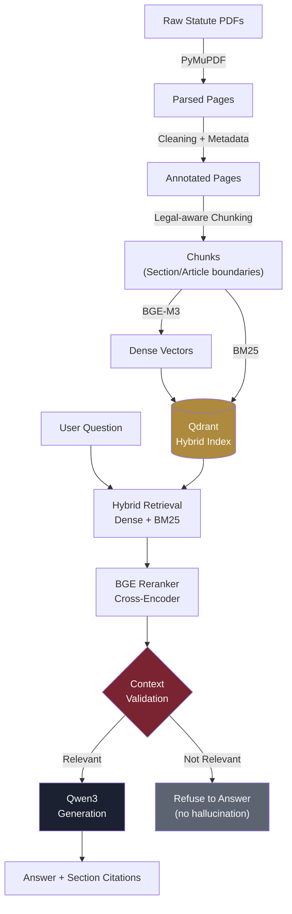

<div align="center">


<br/>

[](https://www.python.org/)
[](https://fastapi.tiangolo.com/)
[](https://qdrant.tech/)
[](https://ollama.com/)
[](https://huggingface.co/BAAI/bge-m3)
[]()

**A retrieval-augmented legal assistant that only answers from statute text it can cite — section, page, and source PDF, every time.**

</div>

---

## Why this exists

Most "chat with your law" demos let an LLM answer from its own training data — which means it can confidently cite a section that doesn't exist, or quote a law that was repealed years ago. This system does the opposite: **every answer is grounded in a specific, retrievable chunk of an actual statute PDF**, reranked for relevance, and validated before generation. If the corpus doesn't contain the answer, the system says so instead of guessing.

It also gets a detail most similar projects miss: **India's criminal law was completely rewritten on 1 July 2024.** The IPC, CrPC, and Evidence Act were repealed and replaced by the Bharatiya Nyaya Sanhita (BNS), Bharatiya Nagarik Suraksha Sanhita (BNSS), and Bharatiya Sakshya Adhiniyam (BSA). This system indexes the **current** law, not the colonial-era statutes still floating around in most tutorials.

---

## Architecture



---

## What's indexed

| Act | Replaces | Status |
|---|---|---|
| **Information Technology Act, 2000** (+ 2008 Amendment) | — | Current |
| **IT Rules, 2021** (Intermediary Guidelines & Digital Media Ethics Code) | IT Rules 2011 | Current, amended through 2023 |
| **Bharatiya Nyaya Sanhita, 2023** | Indian Penal Code, 1860 | Current since 1 Jul 2024 |
| **Bharatiya Nagarik Suraksha Sanhita, 2023** | Code of Criminal Procedure, 1973 | Current since 1 Jul 2024 |
| **Consumer Protection Act, 2019** | Consumer Protection Act, 1986 | Current |

Scope is deliberately narrow: **cyber law and the statutes it's actually prosecuted alongside**, not "all of Indian law." A focused, high-precision corpus beats a broad, diluted one — see [Design Notes](#design-notes) below.

---

## Pipeline stages

| # | Stage | What happens |
|---|---|---|
| 1 | **Parse** | PyMuPDF extracts raw text per page from each statute PDF |
| 2 | **Clean** | Strips headers/footers/OCR noise, annotates metadata |
| 3 | **Chunk** | Splits on Section/Article/Clause boundaries — not arbitrary character counts |
| 4 | **Embed** | BGE-M3 (1024-dim, multilingual) encodes each chunk |
| 5 | **Store** | Chunks + vectors upload to Qdrant; BM25 sparse index built in parallel |
| 6 | **Retrieve** | Query hits both dense (Qdrant) and sparse (BM25) search, fused |
| 7 | **Rerank** | BGE cross-encoder re-scores candidates for true query relevance |
| 8 | **Validate** | Checks whether retrieved chunks actually answer the question — refuses if not |
| 9 | **Generate** | Qwen3 (via Ollama) answers *only* from the validated chunks, with citations |

---

## Tech stack

| Layer | Choice |
|---|---|
| Parsing | PyMuPDF (fitz) |
| Chunking | Custom legal-boundary-aware splitter |
| Dense embeddings | `BAAI/bge-m3` |
| Sparse retrieval | BM25 (`rank_bm25`) |
| Vector DB | Qdrant (hybrid dense + sparse) |
| Reranker | `BAAI/bge-reranker-v2-m3` |
| Generation | Qwen3, served locally via Ollama |
| Backend | FastAPI (CORS-enabled) |
| Frontend | Static HTML/CSS/JS — no build step |
| Local inference | Runs entirely offline once models are pulled — no API keys, no per-query cost |

---

## Quick start (local, no Docker)

You'll need four things running: **Qdrant**, **Ollama**, the **FastAPI backend**, and the **frontend**.

### 1 — Add the source PDFs
```bash
python -m scripts.download_acts
```
Fetches the five Acts above into `data/raw_pdfs/`. Skips any already present.

### 2 — Start Qdrant
```bash
./qdrant.exe          # Windows native binary
# or: docker run -p 6333:6333 qdrant/qdrant
```

### 3 — Start Ollama
```bash
ollama serve
ollama pull qwen3
```

### 4 — Ingest the corpus (one-time, or after adding new PDFs)
```bash
pip install -r requirements.txt
python -m src.pipeline --ingest
```

### 5 — Start the API
```bash
uvicorn api.main:app --host 0.0.0.0 --port 8000
```

### 6 — Open the frontend
Open `app/index.html` directly in a browser. It talks to `http://localhost:8000` — no server needed for the UI itself.

---

## API

```
POST /query
{
  "question": "What is the punishment for hacking under the IT Act?"
}
```

```json
{
  "answer": "Under Section 66 of the IT Act, 2000...",
  "citations": [
    {
      "act_name": "IT_Act_2000",
      "section_no": "66",
      "source_file": "IT_Act_2000.pdf",
      "page_num": 25,
      "rerank_score": 0.992
    }
  ],
  "valid": true
}
```

`GET /health` — liveness check.

---

## Design notes

- **Why not "all of Indian law"?** Retrieval precision degrades as corpus breadth increases without a coherent theme — a bigger, unfocused index means the reranker has to fight harder to separate genuinely relevant chunks from superficially similar ones in unrelated domains. This system is scoped to cyber law and its directly-connected statutes, which is also how these offences are actually prosecuted in practice.
- **Why BNS/BNSS instead of IPC/CrPC?** They were repealed 1 July 2024. Indexing the old codes would mean confidently citing law that no longer applies — the opposite of what a grounded RAG system is supposed to prevent.
- **Context Validation (Stage 8)** exists specifically to stop the model from answering questions the corpus can't actually support, rather than letting the LLM fill gaps from its own training data.

---

## Project structure

```
legal-rag/
├── api/                # FastAPI backend
├── app/                # Static frontend (index.html)
├── data/
│   ├── raw_pdfs/       # Source statute PDFs
│   └── processed/      # Parsed/cleaned/chunked intermediates
├── scripts/
│   └── download_acts.py
├── src/
│   ├── parser.py       # Stage 1
│   ├── cleaner.py       # Stage 2
│   ├── chunker.py       # Stage 3
│   ├── embedder.py      # Stage 4
│   ├── vector_store.py  # Stage 5
│   ├── retriever.py     # Stage 6
│   ├── reranker.py      # Stage 7
│   ├── validator.py     # Stage 8
│   ├── generator.py     # Stage 9
│   └── pipeline.py       # Orchestrator
└── requirements.txt
```

---

<div align="center">

Built by [Yuvraj Pawar](https://github.com/Yuvrajpawar45)

</div>